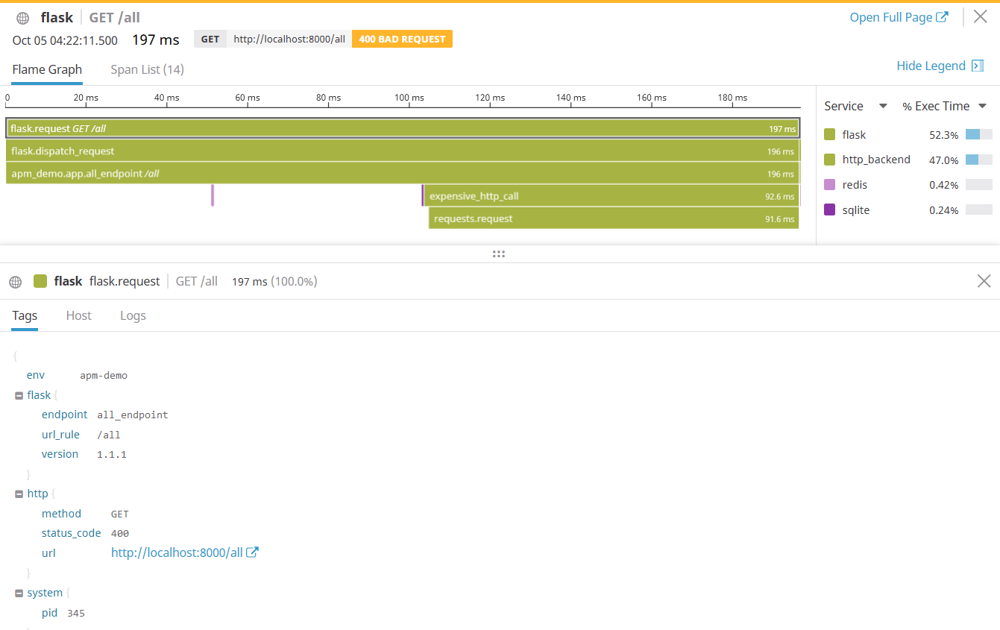

# apm-demo

This is a simple demo, showing how Datadog APM works, with tracing etc.

This demo includes the following components, which are tracked in Datadog APM:
* `Flask`
* `requests`
* `SQL`
* `Redis`

Everything is auto-instrumented, with minimal configuration.
Custom spans are also shown: `@tracer.wrap(name='expensive_http_call', service='http_backend')`

In datadog, the apm will be similar to the following:

The `Flask` Server will return 200, 400 or 500 status codes, to demonstrate how APM shows returned "error" responses.
The HTTP calls that `requests` makes also return 200, 400 or 500 staus code, to demonstrate how APM shows received "error" responses.

# Running `apm-demo`

In order to run this project, first do the following

1. Install the Datadog Agent: https://docs.datadoghq.com/agent/
2. Enable tracing: https://docs.datadoghq.com/tracing/send_traces/
3. Install the dependencies using [`pipenv`](https://github.com/pypa/pipenv)
4. Add dummy data to the SQL database:
    >`$ pipenv run add_data_to_db.py`
5. Start a redis instance:
    > `$docker run -p 6379:6379 redis`

Finally, you can run the flask application:

>`$ FLASK_APP=apm_demo:app DATADOG_ENV=apm-demo pipenv run flask run --port=8000`

`DATADOG_ENV` is a way to easily separate APM to this specific serivce/environment, in Datadog.
